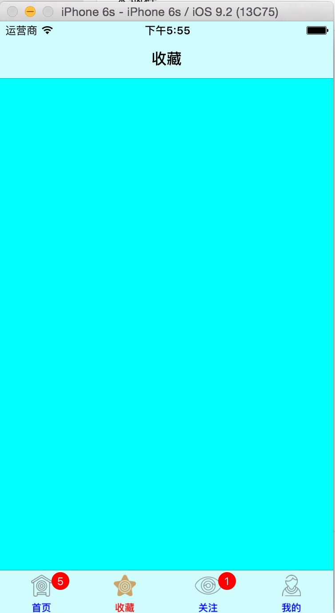

#自定义tabbar

###使用方法

```
UIViewController *vc1 = [[UIViewController alloc] init];
    vc1.title = @"首页";
    vc1.tabBarItem.badgeValue = @"5";
    vc1.tabBarItem.image = [UIImage imageNamed:@"首页图标"];
    vc1.tabBarItem.selectedImage = [UIImage imageNamed:@"首页图标点击后"];
    
    UIViewController *vc2 = [[UIViewController alloc] init];
    vc2.title = @"收藏";
    vc2.tabBarItem.image = [UIImage imageNamed:@"收藏图标"];
    vc2.tabBarItem.selectedImage = [UIImage imageNamed:@"收藏图标点击后"];
    vc2.view.backgroundColor = [UIColor cyanColor];
    
    TestViewController *vc3 = [[TestViewController alloc] init];
    vc3.tabBarItem.badgeValue = @"1";
    vc3.title = @"关注";
    vc3.tabBarItem.image = [UIImage imageNamed:@"关注图标"];
    vc3.tabBarItem.selectedImage = [UIImage imageNamed:@"关注图标点击后"];
    vc3.view.backgroundColor = [UIColor purpleColor];
    
    UIViewController *vc4 = [[UIViewController alloc] init];
    vc4.title = @"我的";
    vc4.tabBarItem.image = [UIImage imageNamed:@"我的图标"];
    vc4.view.backgroundColor = [UIColor blueColor];
    vc4.tabBarItem.selectedImage = [UIImage imageNamed:@"我的图标点击后"];
    
    UINavigationController *nav1 = [[UINavigationController alloc] initWithRootViewController:vc1];
    UINavigationController *nav2 = [[UINavigationController alloc] initWithRootViewController:vc2];
    UINavigationController *nav3 = [[UINavigationController alloc] initWithRootViewController:vc3];
    UINavigationController *nav4 = [[UINavigationController alloc] initWithRootViewController:vc4];
    
    YHTabbarController *tabbar = [[YHTabbarController alloc] init];
    tabbar.tabBar.tintColor = [UIColor redColor];
    
    
    tabbar.itemTitleFont          = [UIFont boldSystemFontOfSize:11.0f];
    tabbar.itemTitleColor         = [UIColor blueColor];
    tabbar.selectedItemTitleColor = [UIColor redColor];
    tabbar.badgeTitleFont         = [UIFont boldSystemFontOfSize:14.0f];

    tabbar.viewControllers = @[nav1,nav2,nav3,nav4];
    
    
    self.window.rootViewController = tabbar;
```


